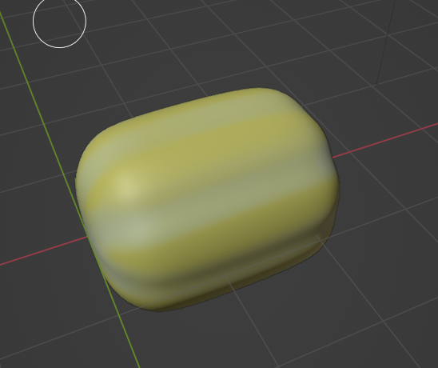

1. UnReal Engine  https://www.youtube.com/watch?v=6UlU_FsicK8 
    - 6/9/2023 UnReal Engine basic getting the Reference. - Downloaded the program
    - 6/10/2023 UnReal Engine Stack O Bot Tutorial 15min
    - 6/20/2023 Understand how users are interacting in Unreal Engine. But still have to think about what type of game that I want to build.
    - 6/23/2023 Should study the Physics Engine 

2. Blender 
   - 6/11/2023 Basic Blender - Modeling and smoothing 
   - 6/12/2023 Texture drawing and using Rendering (modeling an Egg, Avocado, and Bread)
   - 6/13/2023 Lighting and Rendering 
   
 
   - 6/14/2023 building a small room with bed and table - utilized the sculpting 
   - 6/15/2023 Worked on Chair and Book -> how to copy and use the center cursor to the selector
   - 6/16/2023 Lighting and Rendering for the House project 
  
  
   - 6/18/2023 started building a self-designed object, the Traditional Korean food Injulmi.
   - 6/20/2023 for the Injulmi's texture of powdery I might use the Dust Feature. (using sand texture made it worse it ruined the cute feeling of the circular Items.)
   - 6/21/2023 Injulmi's texture the powdery, and I used the particles for the foggy and dusty. It wasn't that good but it might be better if these particles are on the Injulmi itself. 
  
   - 7/26/2023 making 참외 (Korean melon)
   - 8/09/2023 참외 MODELING is done should work on the color
   
   - 
3. AI and ML Study 
   - 6/15/2023 AWS AI&ML Kick-off session and the first section is done
   - 6/18/2023 AWS Session Attended
   - 6/19/2023 AWS Control Flow Lecture started
   - 6/20/2023 AWS Control Flow done
   - 6/21/2023 AWS Functions started it is about building basic functions in Python.
   - 6/22/2023 AWS Function Done!
   - 6/23/2023 AWS Anaconda Install - Its already installed
   - 6/27/2023 Building first project - using parser(it is more like getting a file info storing), os(makeing output dict, it is more like calling files and making as a list)
   - 6/29/2023 First Project done! / Started Learning Stat 101
   - 6/30/2023 Anaconda started
   - 7/03/2023 Anaconda is keep making problems
   - 7/04/2023 Anaconda is working on a Jupyter notebook
   - 7/05/2023 Numpy started
   - 7/10/2023 Numpy Done
   - 7/11/2023 Pandas Started Saw some students fin the course
   - 7/19/2023 Matplotlib
   - 7/24/2023 Matplotlib part 1 is done but it is a bit hard to understand the position of the elements
   - 7/27/2023 Matplotlib - scatter & hist2d
   - 7/28/2023 Matplotlib - violin & box --> seaborn
   - 7/28/2023 Matplotlib - Categorical Plot --> setting up the data is a bit hard
   - 8/01/2023 Linear Combination - the concept is easy but not sure about how I should solve this
   - 8/01/2023 Linear Transformation and Matrices
   - 8/05/2023 Calculus
   - 8/07/2023 Limits
   - 8/08/2023 Calculus in Neural Networks
   - 8/12/2023 Introduction to Neural Network
   - 8/13/2023 Maximizing Probabilities
   - 8/15/2023 Cross-Entropy
   - 8/16/2023 Logistic Descent
   - 8/17/2023 Gradient Descent
   - 8/18/2023 Training Neural network
   - 8/21/2023 have No idea -> don't know How to build an image classifier
   - 8/22/2023 Deep Learning with PyTorch
   - 8/25/2023 Tensors in PyThorch 
   - 8/27/2023 Neural Networks in PyTorch
   - 8/28/2023 Training Neural Networks & Fashion-MNIST
   - 8/29/2023 Inference and Validation & Saving and Loading Models 
   - 8/30/2023 Loading Image Data & Transfer Learning 
   - 8/31/2023 Project 2 worked on -> classifier done
   - 9/03/2023 Project 2 Image loading worked on
   - 9/05/2023 Project 2 Keep working on the predict
   - 9/08/2023 Project 2 Jupyter notebook is working perfectly
   - 9/10/2023 Project 2 Python working on the predict part but it is not working as i intended
   - 9/11/2023 Project 2 python training is working but still working on the predict file
   - 9/13/2023 Project 2 sumbit & pass
   - 9/15/2023 Graduation process
   - 10/07/2023 Graduated Done ! 
4. Game Idea Memo
   - Games that don't need language
   - 2D or 3D
   - Could be Web-based & Unreal Engine
   - rather than Drawing I want it to be more mood
   - better to be healing
   - wants to contain memories
   - or recall memories
   - memories with parents might be good too
   - Voice Recording - or video storytelling ish?
   - I am not good at 2D drawings
   - Similar to princess maker according to the sentiment analysis
   - 
5. Building TTS bot
   - Recorded the voice data (meta Deta)
   - ML is done
   - working on the server part
   - asked about the error
6. Data Analyst Study
   - Done 3rd part of the course
   - Working on the practice of SQL & Spread Sheet 
