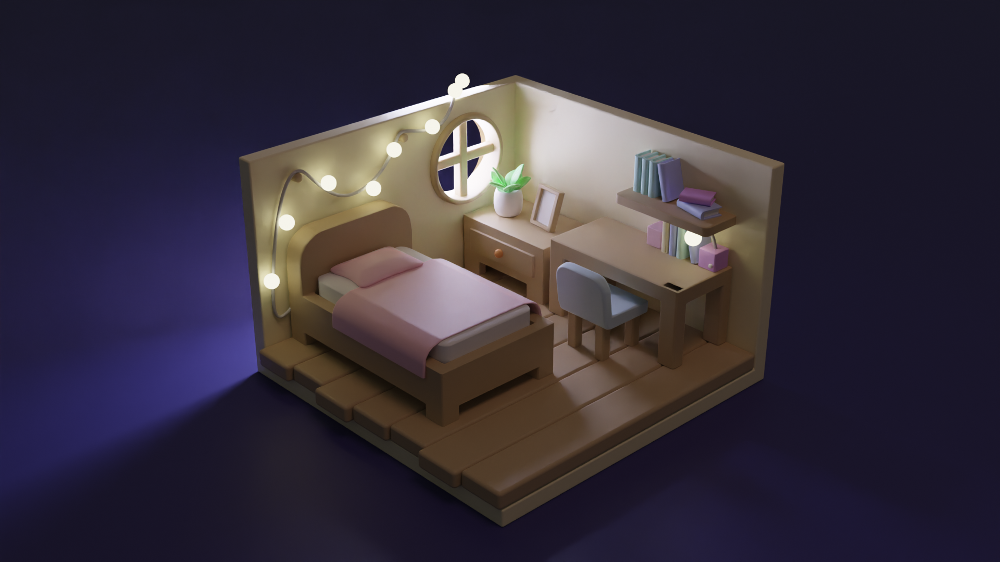

1. UnReal Engine  https://www.youtube.com/watch?v=6UlU_FsicK8 
  - 6/9/2023 UnReal Engine basic getting the Reference. - Downloaded the program
  - 6/10/2023 UnReal Engine Stack O Bot Tutorial 15min 
2. Blender 
 - 6/11/2023 Basic Blender - Modeling and smoothing 
 - 6/12/2023 Texture drawing and using Rendering (modeling an Egg, Avocado, and Bread)
 - 6/13/2023 Lighting and Rendering 
 
 
 - 6/14/2023 building a small room with bed and table - utilized the sculpting 
 - 6/15/2023 Worked on Chair and Book -> how to copy and use the center cursor to the selector
 - 6/16/2023 Lighting and Rendering for the House project 

 - 6/18/2023 started building a self-designed object, the Traditional Korean food Injulmi.
 - 6/20/2023 for the Injulmi's texture of powdery I might use the Dust Feature. (using sand texture made it worse it ruined the cute feeling if the circular Items.) 

3. AI and ML Study 
 - 6/15/2023 AWS AI&ML Kick-off session and the first section is done
 - 6/18/2023 AWS Session Attended
 - 6/19/2023 AWS Control Flow Lecture started
 - 6/20/2023 AWS Control Flow done
